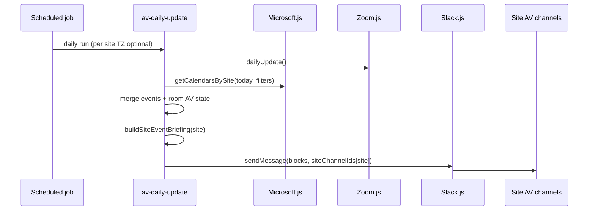

# Office Day Copilot — Phase 1 Technical Spec

**App:** `apps/av-daily-update` (extend) or `apps/office-day-copilot` (thin wrapper—recommend extend daily-update for Phase 1)  
**Modules:** `Slack.js`, `Microsoft.js`, `Zoom.js`, `shared/config.json`  
**Delivery:** Existing **AV site Slack channels** (see [PRD channel map](./PRD.md#av-slack-channel-map-existing))

---

## 1. Architecture



**Principle:** One message per site per run—extend the message already sent by `sendSiteSpecificAlerts()`, do not create parallel bots or channels.

---

## 2. Channel routing (implementation)

Reuse pattern from `app.js`:

```javascript
const targetChannel = process.env.mode === 'testing'
  ? slack.testSiteChannelId
  : slack.siteChannelIds[site];
```

**Site keys must match** Zoom/site grouping codes: `IRV`, `SEA`, `SFO`, `NYC`, `DEN`, `KCY`.

**Config source:** `shared/config.json`:

```json
"slack": {
  "channelIds": {
    "alert": "C07SY86AY31",
    "testSiteAlert": "C09HL5L98KT",
    "IRV": "C05SUTC4D50",
    "SEA": "C02QZ6M3JTF",
    "SFO": "C064BQYFL2F",
    "NYC": "C05U76M61A5",
    "DEN": "C08FS39GCLR",
    "KCY": "C0963N20WP3"
  }
}
```

**Slack.js** already exposes `this.siteChannelIds` — no change required for routing; optional helper:

```javascript
getSiteChannel(siteCode) {
  const id = this.siteChannelIds[siteCode];
  if (!id) console.warn(`No Slack channel for site: ${siteCode}`);
  return id;
}
```

---

## 3. Microsoft.js — new work

### 3.1 Gap analysis

| Documented | Actual in repo |
|------------|----------------|
| `getCalendarsBySite()` | **Missing** — only `getUserEvents`, `getTodaysEvents`, `getEventsInRange` |
| Wired in `collectAllData()` | **No** — Microsoft not imported in `app.js` |

### 3.2 New config block (proposed)

Add to `shared/config.json`:

```json
"microsoft": {
  "filters": ["All Hands", "zRetreat", "Board Room"],
  "hideMeetingDetails": ["Olympic Board Room"],
  "roomCalendars": {
    "IRV": [
      { "email": "room@company.com", "displayName": "IRV-1250 zRetreat", "zoomRoomMatch": "IRV-1250" }
    ],
    "SEA": []
  }
}
```

*Populate `roomCalendars` from Facilities / M365 resource list—one-time spreadsheet → JSON.*

### 3.3 Methods to implement

```javascript
// shared/modules/Microsoft.js

/**
 * Returns { IRV: Event[], SEA: Event[], ... } for today's window in site timezone.
 */
async getCalendarsBySite(options = {}) {
  const { filters, roomCalendars, hideMeetingDetails } = config.microsoft;
  const siteTimezones = config.siteTimezones;
  const result = {};

  for (const [site, rooms] of Object.entries(roomCalendars)) {
    const tz = siteTimezones[site] || 'America/Los_Angeles';
    const { start, end } = getSiteDayBounds(tz); // local midnight → midnight

    const events = [];
    for (const room of rooms) {
      const { value } = await this.getEventsInRange(room.email, start, end);
      for (const ev of value) {
        if (!passesFilters(ev, filters)) continue;
        if (hideMeetingDetails?.some(n => ev.subject?.includes(n))) {
          ev._redacted = true;
        }
        events.push({ ...ev, site, roomDisplayName: room.displayName, zoomRoomMatch: room.zoomRoomMatch });
      }
    }
    result[site] = events.sort(byStartTime);
  }
  return result;
}

function passesFilters(event, filters) {
  const subject = event.subject || '';
  return filters.some(f => subject.toLowerCase().includes(f.toLowerCase()));
}
```

Use existing `getEventsInRange` (already supports `location` in select—extend select to `subject,start,end,organizer,location,isOnlineMeeting,onlineMeeting`).

### 3.4 Permissions

- Graph app: `Calendars.Read` application permission on **room resource mailboxes**
- Admin consent per mailbox or all-room security group

---

## 4. Data merge — `buildSiteEventBriefing(site, dailyData, calendarEvents)`

**Inputs:**

- `dailyData.sites[site].zoom` — offline rooms + issues (existing)
- `dailyData.sites[site].qsys` — systems with errors (existing)
- `calendarEvents[site]` — today’s filtered events

**Matching logic:**

1. Normalize Zoom room names: strip suffixes, compare `zoomRoomMatch` prefix.
2. For each calendar event, find Zoom room where `roomName.includes(zoomRoomMatch)` or fuzzy match score ≥ threshold.
3. Emit readiness:

| State | Condition |
|-------|-----------|
| `:white_check_mark: Ready` | Room matched, all devices Online, no Q-SYS issues on matched system |
| `:warning: Check AV` | Room matched, any offline device or Q-SYS error |
| `:grey_question: Unknown` | Event has no room match |
| `:lock: Details hidden` | `hideMeetingDetails` match |

**Splunk payload extension:**

```json
{
  "event": "av.daily.update",
  "data": {
    "siteEventBriefings": [{
      "site": "IRV",
      "date": "2026-05-19",
      "events": [{
        "subject": "IRV All Hands",
        "start": "2026-05-19T14:00:00",
        "roomMatch": "IRV-3619 All Hands",
        "readiness": "check_av",
        "offlineDevices": 1
      }]
    }]
  }
}
```

---

## 5. Slack delivery — extend `sendSiteSpecificAlerts`

**File:** `apps/av-daily-update/app.js`

```javascript
async function sendSiteSpecificAlerts(dailyData, calendarsBySite = {}) {
  for (const [site, data] of Object.entries(dailyData.sites)) {
    let siteReport = existingHeader(site); // keep current greeting + Zoom section

    const events = calendarsBySite[site] || [];
    if (events.length > 0) {
      siteReport += buildEventsSectionMarkdown(site, events, data);
      // Phase 1b: optional blocks via generateSiteEventBlocks()
    }

    siteReport += generateSiteZoomReport(site, data.zoom) ?? allClearMessage(site);
    // ... existing send to slack.siteChannelIds[site]
  }
}
```

**Order in message:**

1. Greeting + quick links (existing)  
2. **NEW: Events today** (calendar + AV readiness)  
3. Zoom offline digest (existing)  

---

## 6. Block Kit mockup (Events today section)

Use `slack.sendMessage({ blocks, text }, channel)` — `Slack.js` already supports blocks in `sendMessage`.

### 6.1 JSON (reference payload)

```json
{
  "text": "IRV — Events today (May 19)",
  "blocks": [
    {
      "type": "header",
      "text": { "type": "plain_text", "text": "IRV — Events today", "emoji": true }
    },
    {
      "type": "context",
      "elements": [
        { "type": "mrkdwn", "text": "AV status as of 8:00 AM PT · <https://docs.google.com/...|Common AV Errors>" }
      ]
    },
    { "type": "divider" },
    {
      "type": "section",
      "text": {
        "type": "mrkdwn",
        "text": "*2:00 PM — IRV All Hands*\n:warning: *Check AV* · Room `IRV-3619 All Hands`\n• Neat Pad offline · Q-SYS OK"
      },
      "accessory": {
        "type": "button",
        "text": { "type": "plain_text", "text": "Zoom dashboard" },
        "url": "https://zoom.us/...",
        "action_id": "open_zoom_irv_3619"
      }
    },
    {
      "type": "section",
      "text": {
        "type": "mrkdwn",
        "text": "*4:30 PM — zRetreat customer session*\n:white_check_mark: *Ready* · `IRV-1250 zRetreat`"
      }
    },
    {
      "type": "context",
      "elements": [
        { "type": "mrkdwn", "text": "Reply in thread for AV help · Next full digest tomorrow 8 AM" }
      ]
    }
  ]
}
```

### 6.2 Builder function (new file)

`apps/av-daily-update/generateSiteEventBlocks.js`:

```javascript
export function generateSiteEventBlocks(site, events, avState, options = {}) {
  const blocks = [
    {
      type: 'header',
      text: { type: 'plain_text', text: `${site} — Events today`, emoji: true }
    },
    {
      type: 'context',
      elements: [{
        type: 'mrkdwn',
        text: `AV status as of ${options.asOfLabel} · <${options.errorsDocUrl}|Common AV Errors>`
      }]
    },
    { type: 'divider' }
  ];

  for (const ev of events) {
    const { emoji, label, detail } = readinessForEvent(ev, avState);
  blocks.push({
      type: 'section',
      text: {
        type: 'mrkdwn',
        text: `*${formatTime(ev)} — ${ev.subject}*\n${emoji} *${label}* · ${detail}`
      }
    });
  }

  if (events.length === 0) {
    blocks.push({
      type: 'section',
      text: { type: 'mrkdwn', text: '_No flagship events on today's calendar._' }
    });
  }

  return blocks;
}
```

**Phase 1 launch:** Markdown section first (faster); Block Kit in 1b once copy is validated.

---

## 7. File change checklist

| File | Change |
|------|--------|
| `shared/config.json` | Add `microsoft.roomCalendars` per site |
| `shared/modules/Microsoft.js` | Implement `getCalendarsBySite`, `getSiteDayBounds` helper |
| `apps/av-daily-update/app.js` | Import Microsoft; collect calendars; pass to `sendSiteSpecificAlerts` |
| `apps/av-daily-update/generateSiteEventBlocks.js` | **New** — Block Kit builder |
| `apps/av-daily-update/generateSlackReport.js` | Optional: link to site channels in main digest |
| `shared/modules/Slack.js` | Optional: `getSiteChannel(site)` helper |
| `test/scenarios/site-event-briefing.js` | **New** — fixture merge tests |
| `docs/office-day-copilot/*` | PRD + this spec |

---

## 8. Testing

```bash
# Test mode → all site messages to testSiteAlert (C09HL5L98KT)
mode=testing npm run test:daily-update

# Fixture-only (no Graph): inject calendarsBySite from test/fixtures/irv-events.json
```

**Cases:**

1. Site with events + offline Zoom → `:warning:`  
2. Site with no events → omit section or “no flagship events”  
3. Olympic Board Room → redacted subject, time only  
4. Site in Zoom data without Slack channel → warn, no throw  
5. Event room with no Zoom match → `:grey_question:`  

---

## 9. Example end-to-end message (IRV → `C05SUTC4D50`)

```
Good Morning, IRV! Here is your daily AV update.

*Quick Reference:* <Common AV Errors doc>

--------------------------------------------------

*Events today* (AV status as of 8:00 AM PT)

• *2:00 PM — IRV All Hands* — :warning: Check AV
  Room IRV-3619 All Hands · 1 device offline (Neat Pad)

• *4:30 PM — zRetreat session* — :white_check_mark: Ready
  Room IRV-1250 zRetreat

--------------------------------------------------

*Zoom offline rooms*
...
```

---

## 10. Phase 1 timeline (engineering, not calendar)

| Step | Work |
|------|------|
| 1 | Inventory M365 room mailboxes → `roomCalendars` JSON |
| 2 | Implement `getCalendarsBySite` + unit tests |
| 3 | Merge function + markdown section in site alerts |
| 4 | Pilot SEA + IRV in `mode=testing` for 1 week |
| 5 | Production in site channels; Splunk fields |
| 6 | Block Kit upgrade (1b) |

---

## 11. Open questions

1. Canonical list of **room resource emails** per site—who owns? (Facilities / IT)  
2. Should **Olympic** events post only to `Olympic` channel instead of site channel?  
3. Separate **event-specific** Slack channels for summits, or always site AV channels?  
4. Google Calendar (`GoogleCalendar.js`) needed for any sites on Google vs M365 only?  

---

## 12. Module API quick reference

| Module | Phase 1 usage |
|--------|----------------|
| `Slack.js` | `sendMessage({ blocks, text }, siteChannelIds[site])` |
| `Microsoft.js` | **New** `getCalendarsBySite()` using `getEventsInRange` |
| `Zoom.js` | Existing `dailyUpdate()` → `slackRooms` by site |
| `QsysDiagnostics` / `qrem` | Existing site metrics for readiness |
| `GoogleCalendar.js` | Not Phase 1 unless room calendars are Google-only |
| `config.json` | `slack.channelIds`, `microsoft.filters`, `siteTimezones` |
